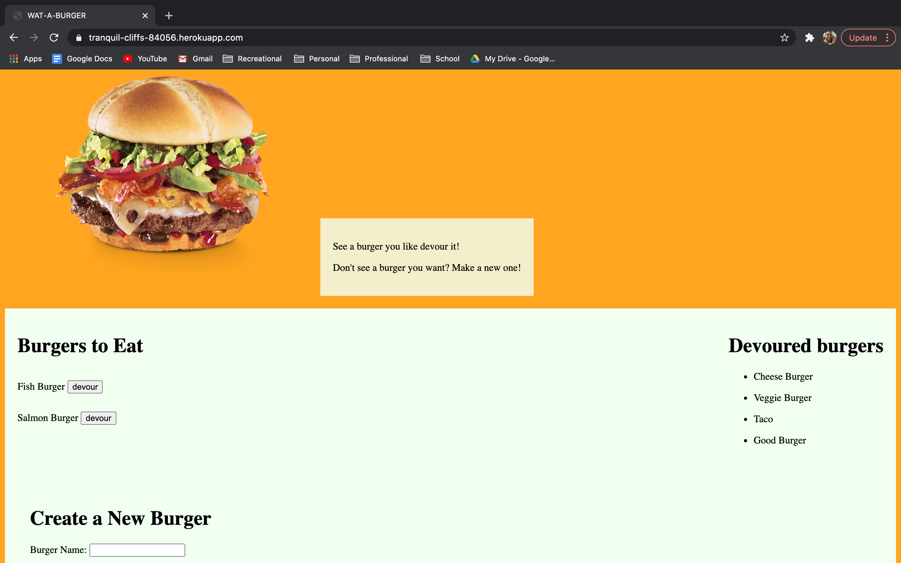

# WAT_A_BURGER

## Links 

For the Repository link click [here](https://github.com/valadezMykel/WAT_A_BURGER)

For a link to the deployed project click [here](https://tranquil-cliffs-84056.herokuapp.com/)

## Table of Contents

* [About the Project](#about-the-project)
* [Installation](#installation)
* [Usage](#usage)
* [License](#license)
* [Contributors](#contributors)
* [Questions](#questions)

## About the Project

WHAT YOU WANT A BURGER?  WELL GOOD HERE SOME GOOD BURGERS COME GET A BURGER.

## Installation

Clone this repository, set your environment variable to connect to the db that you create using the seed and shcema.  Then run server.js in node.

## Usage

Not much, but I did learn more about structuring files and making your project easily extensible.

## License

MIT

## Contributors

Mykel Valadez

## Questions

If you have questions reach out by email at spamaladez@yahoo.com